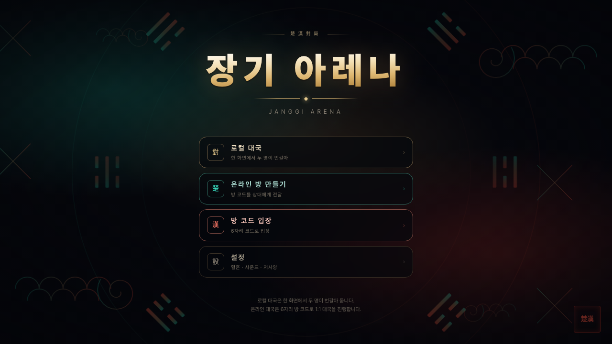
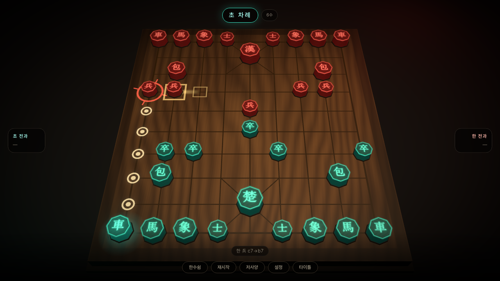
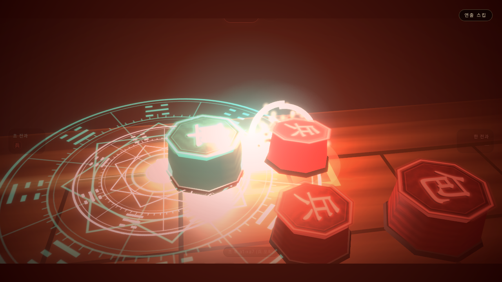
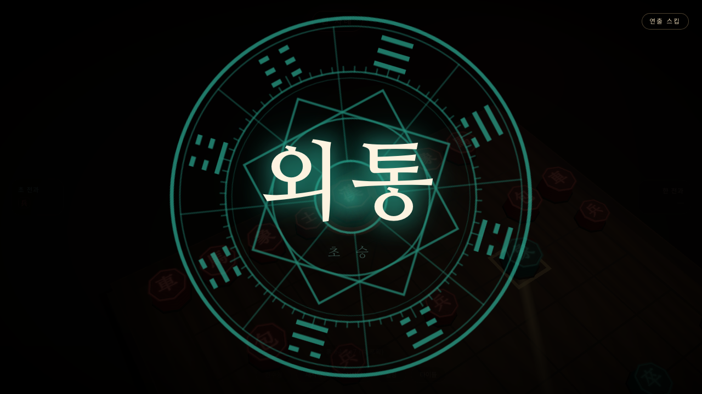
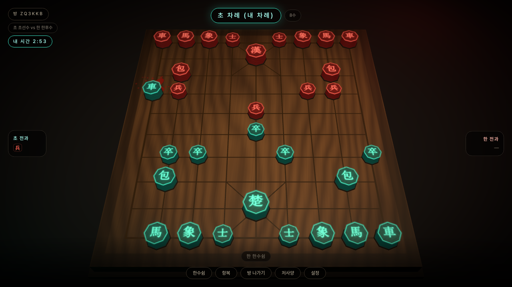

# 장기 아레나 (Janggi Arena)

> 한(漢) vs 초(楚). 말을 잡는 순간마다 기물이 각성해 상대를 처단하는 **웹 3D 한국 전통장기**.

브라우저에서 바로 도는 3D 장기 게임입니다. 장기 룰은 엔진에 100% 구현되어 있고, 포획이 일어날 때마다
기물 종류별로 **서로 다른 전투 연출 7종**이 재생됩니다. 로컬 2인 대국은 서버 없이 동작하고, 온라인
1:1 대국은 서버가 룰을 검증하는 권위 서버 방식입니다.

**외부 에셋이 하나도 없습니다.** 3D 지오메트리는 프리미티브 조합, 텍스처(한자 각인·나뭇결·문양)는 캔버스
생성, 효과음은 Web Audio 합성, 타이틀 배경 문양은 SVG 프로시저럴입니다. 유일한 외부 리소스는 로고에 쓰는
Pretendard 웹폰트(CDN)뿐이고, 그마저 로드 실패 시 시스템 폰트로 폴백됩니다.

---

## 스크린샷

| 타이틀 | 대국 화면 |
| --- | --- |
|  |  |
| 프로시저럴 전통 문양(격자·팔괘·구름) 배경 | 선택한 기물의 합법 도착점·포획 지점 하이라이트 |

| 포획 연출 | 외통 승리 연출 |
| --- | --- |
|  |  |
| 암전 → 소환진 → 타격 → 디졸브 → 재 붕괴 | 팔괘 문양 전개 + 슬로모션 카메라 선회 |

| 온라인 1:1 대국 |
| --- |
|  |
| 방 코드 입장 · 서버 권위 검증 · 턴 타이머 · 항복 |

> `artifacts/` 의 이미지는 모두 Playwright E2E가 실제 플레이를 재생하며 자동 촬영한 것입니다.

---

## 빠른 시작

요구사항: **Node 20+**, **pnpm 10+** (`corepack enable` 로 활성화)

```bash
pnpm install
```

### 로컬 2인 대국 (서버 불필요)

```bash
pnpm -F web dev            # http://localhost:3002
```

한 화면에서 두 명이 번갈아 둡니다. 서버가 없어도 100% 동작합니다.

### 온라인 1:1 대국 (웹 + 서버)

```bash
# 터미널 1 — 대국 서버 (engine 빌드 → tsc → 실행)
pnpm -F server build && pnpm -F server start          # http://localhost:3001

# 터미널 2 — 웹 (서버 주소는 빌드/기동 시점에 주입된다)
NEXT_PUBLIC_SERVER_URL=http://localhost:3001 pnpm -F web dev
```

브라우저 두 개(또는 시크릿 창)를 열고 한쪽에서 **온라인 방 만들기** → 표시된 6자리 방 코드를
다른 쪽에서 **방 코드 입장**에 입력하면 대국이 시작됩니다.

포트 규칙: 웹 3002 / API 3001 (API = 프론트 − 1). `WEB_PORT`, `PORT` 로 바꿀 수 있습니다.

### Docker Compose

```bash
docker compose build                      # 두 이미지 빌드
docker compose up -d                      # web :3002, server :3001
docker compose down
```

호스트 포트가 이미 쓰이는 중이면 바꿔서 띄웁니다(웹은 서버 주소를 빌드 시점에 굽기 때문에 `--build` 필수):

```bash
WEB_PORT=4002 SERVER_PORT=4001 docker compose up -d --build
```

---

## 모노레포 구조

```text
janggi/
├─ packages/engine      장기 룰 엔진 — 순수 TypeScript, 런타임 의존성 0
│                       웹과 서버가 같은 엔진을 공유한다 (판정 불일치 불가능)
├─ apps/web             Next.js 15 (App Router) + React Three Fiber
│   ├─ app/             단일 라우트. 타이틀 ↔ 로비 ↔ 대국은 스토어 전환이라
│   │                   WebGL 컨텍스트와 프로시저럴 텍스처가 그대로 살아 있다
│   ├─ src/game/        zustand 스토어 (엔진 상태 → 화면 데이터 파생)
│   ├─ src/components/board/    3D 판·기물·마커
│   ├─ src/components/board/vfx/  연출 상태머신, 파티클, 디졸브 셰이더
│   │   └─ variants/    기물별 고유 공격 연출 7종 (레지스트리로 교체 가능)
│   ├─ src/components/game/     HUD·오버레이·타이틀
│   ├─ src/audio/       Web Audio 합성 SFX
│   ├─ src/net/         socket.io 클라이언트 + 프로토콜 타입
│   └─ e2e/             Playwright 시나리오 (스크린샷 → artifacts/)
├─ apps/server          NestJS + socket.io 권위 서버 (PROTOCOL.md가 통신 계약)
└─ docs/                PRD · RULES · SCENES · DECISIONS
```

---

## 테스트

```bash
pnpm -F engine test        # 룰 엔진 단위 테스트          (215 tests)
pnpm -F server test        # 서버 · 방 · 프로토콜 테스트   (51 tests)
pnpm -F web build          # 프로덕션 빌드 + 타입 검사
pnpm -F web e2e            # Playwright E2E              (26 tests)
```

E2E는 headless로 돌면서 각 시나리오의 스크린샷을 `artifacts/` 에 저장합니다. 웹·서버 개발 서버는
Playwright가 알아서 띄우고 내립니다.

추가 검증 도구:

```bash
pnpm -F engine perft       # 초기 국면 깊이별 수 생성 자가 검증
pnpm -F web fixtures:p4    # 기물 7종 포획 기보 생성 + 엔진 검증
```

---

## 기술 스택

| 영역 | 사용 기술 |
| --- | --- |
| 룰 엔진 | TypeScript (의존성 0), vitest |
| 프론트 | Next.js 15 (App Router), React 19, TypeScript, Tailwind CSS v4 |
| 3D | three.js, @react-three/fiber, @react-three/drei, @react-three/postprocessing |
| 상태 | zustand |
| 서버 | NestJS 11, socket.io 4 |
| 사운드 | Web Audio API 합성 (에셋 없음) |
| 테스트 | vitest, Playwright |
| 패키지 | pnpm workspace |

---

## 룰 구현 범위

전체 명세는 [`docs/RULES.md`](docs/RULES.md). 요약하면:

- **판**: 9줄 × 10칸 교차점, 궁성 3×3 + 대각선(X자). 좌표 `a1`~`i10`, 초가 아래·선수
- **배치**: 마상상마 고정 (차림 선택 없음)
- **차(車)** — 가로·세로 임의 거리. 궁성 대각선 위에서는 대각으로도 관통
- **포(包)** — 반드시 정확히 1개의 포다리를 넘는다. 포는 포를 넘지도 잡지도 못한다. 궁성 대각 포함
- **마(馬)** — 직선 1 + 바깥 대각 1, **멱** 차단
- **상(象)** — 직선 1 + 같은 방향 대각 2, **멱 2곳** 차단
- **졸·병(卒·兵)** — 전진 1 또는 좌우 1, **후퇴 불가**. 적 궁성 안에서는 대각 이동
- **사(士)·궁(將)** — 궁성 밖으로 못 나감, 궁성 선을 따라서만 이동
- **장군 / 자살수 금지 / 외통** 판정
- **한수쉼(패스)** — 가능. 단 장군 상태에서는 불가 (그래서 스테일메이트가 존재하지 않는다)
- **빅장(왕 대면)** — 두 궁이 사이에 기물 없이 마주 보면 그 즉시 무승부
- **반복 무승부** — 동일 국면(배치 + 차례) 3회 반복 시 무승부

온라인 대국에서는 서버가 위 엔진으로 모든 수를 재검증합니다. 클라이언트는 `(from, to)` 좌표만 보내고,
판은 서버가 내려주는 스냅샷만 그립니다(로컬에서 판을 진행시키지 않습니다). 추가로 **1수 60초 턴 타이머**,
시간 초과 시 자동 한수쉼(2회 누적 시 몰수패), **항복**이 서버 판정으로 붙습니다.

점수제(덤)·무르기·재접속 복구는 범위 밖입니다 ([`docs/PRD.md`](docs/PRD.md) 3절).

---

## 조작법

| 동작 | 방법 |
| --- | --- |
| 기물 선택 | 기물 클릭/탭 → 합법 도착점이 빛나는 마커로 표시 |
| 이동·포획 | 마커 클릭/탭 (같은 기물 재클릭 = 선택 해제) |
| 카메라 | 드래그 = 회전(각도 제한), 휠/핀치 = 줌 |
| 한수쉼 | 하단 **한수쉼** — 장군 상태에서는 비활성 |
| 연출 스킵 | 연출 중 화면 아무 곳이나 클릭/탭 |
| 저사양 | 하단 **저사양** — 후처리 OFF · 파티클 절반 · 렌더 해상도 1x |
| 설정 | 하단(또는 타이틀) **설정** — 혈흔 ON/OFF · 사운드 ON/OFF · 저사양 |
| 재시작 / 항복 | 로컬은 **재시작**, 온라인은 **항복** · **방 나가기** |

혈흔 표현은 기본 ON이며 끄면 붉은 파티클이 백금색 스파크로 대체됩니다(15세이용가 기준,
[`docs/PRD.md`](docs/PRD.md) 2절).

---

## 문서

| 문서 | 내용 |
| --- | --- |
| [`docs/PRD.md`](docs/PRD.md) | 제품 명세 — 화면 구성, 비주얼 방향, 성능 목표 |
| [`docs/RULES.md`](docs/RULES.md) | 룰의 유일한 기준 + 테스트 벡터 |
| [`docs/SCENES.md`](docs/SCENES.md) | 연출 사양 — 공통 타임라인, 기물별 고유 연출 |
| [`docs/DECISIONS.md`](docs/DECISIONS.md) | 자율 결정 로그 |
| [`apps/server/PROTOCOL.md`](apps/server/PROTOCOL.md) | socket.io 통신 계약 |
| [`TASKS.md`](TASKS.md) · [`PROGRESS.md`](PROGRESS.md) | 진행 체크리스트 · 페이즈 완료 기록 |
